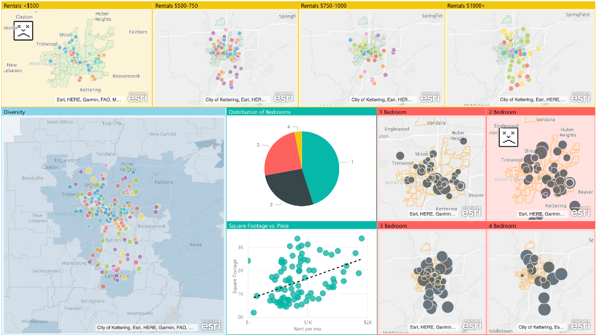

# Dayton Housing

## Abstract 

This web scraper and corresponding data visualization and analysis was completed in order to better understand Dayton, OH's housing market. Currently, low-income Daytonians often pay either unaffordable rates for adequate housing or affordable rates for inadequate housing. The webscraper was written in Python in a Jupyter Notebook hosted by Microsoft Azure Notebooks. It sought to identify key characteristics in html code and write those data values to a csv file. The data visualization and analysis was conducted in Microsoft Power BI and involved mapping data points, overlaying U.S. census data, and examining the distribution of price and bedrooms. The data confirmed the previously hypothesized socioeconomic, racial, and geographic indicators present in Dayton's housing market.

### Introduction

Dayton, OH is a legacy city that was hit hard by the 2008 financial crisis. Over 10 years later, low-income Dayton residents still struggle to find affordable, adequate, and available housing. Although Dayton has a plethora of housing structures, many structures are in disrepair and thus, inhabitable. This reduces the supply of adequate, affordable housing. As a result, low-income residents often pay unaffordable rates for adequate housing or affordable rates for inadequate housing.

In order to better identify policy solutions to this housing problem, the City of Dayton wanted more information about the housing market of Dayton, OH. More specifically, they wanted to have data that extended beyond official real estate sale records; they were interested in what properties were being offered for sale or rent, their condition, and their prices. In an effort to meet this need, I built this web scraper in summer 2019 to collect relevant data and conducted analysis on that data. I also wanted my web scraper to be a tool the city could use to measure the impact of their policies for years to come.

### Materials and Methods

I wrote this program in Python. I used get, RequestException, closing, urllib, BeautifulSoup, numpy, csv, os, and sys packages. I developed this program in a Jupyter Notebook hosted by Microsoft Azure Notebooks.

I used Realtor.com and Dayton's Craiglist site as my source for property listings. I used these websites as they captured both the "official" housing market (such as real estate listings on Realtor.com) and the "unofficial" housing market (such as sublets listings on Craigslist). For Realtor.com, I used a general "Dayton, OH" search. For Craiglist, I selected my desired listing types under "housing" (apt/housing for rent, real estate, room & shares, and sublets & temporary). I also limited my location to within a 7 mile radius of the zip code 45402. I set these parameters to collect all relevant listings while avoiding being redirected at the end of a search. Avoiding redirects was important as they prevented my code from moving onto writing collected data to a csv file.

To build the web scraper, I wrote a program that 1) extracted the html file from a given url, 2) parsed through the file to find key characteristics (e.g. address, price, etc.), 3) wrote those characteristics to a csv file, 4) and repeated that same process for each page of a search result. As my program progressed, I incorporated additional characteristics.

To conduct analysis, I mapped my data points based on their longitude and latitude and overlayed U.S. census data on common indicators such as median household income, educational level of attainment, etc. I also use data visualization tools, such as scatter plots and pie charts to better understand the distribution of the data. All of my analysis was conducted in Microsoft Power BI.

### Results & Conclusion

Because this program had two distinct arms, the web scraper and data analysis/visualization, I will discuss my results separately.

For the web scraper, I constructed a web scraper that collected the url, address, longitude, latitude, price, number of bathrooms, and number of bedrooms for each property.

From the data analysis/visualization portion, there a couple of take-aways:

First, as rentals become increasingly expensive, they become increasingly far away from the city. They begin to stretch into the southern suburbs, which are generally considered affluent. Furthermore, there is extremely limited availability of affordable listings in the southeastern and northwestern parts of the city. These areas are both substantially wealthier than the northwestern parts of the city, where most of the affordable listing are concentrated.

Second, there are comparatively few listings, regardless of property type and price, in areas where there is little diversity. Most listings are located in areas with high diversity.

Third, 1 bedrooms make up the bulk of listings. No properties with more than 4 bedrooms were listed.

Also, as rent increases, square footage range increases. For example, a renter who can pay about $800/mo. has about double the range in square footage as a renter who can pay about $400/mo.

Finally, the larger the property is, the more likely it will be far away from the city. Based on preliminary analysis, it seems like there is the largest range of prices for 1 bedroom properties (though they are predominantly located in the less wealthy parts of the city). As properties become larger, specifically in the 2 bedroom and 2 bedroom range, they are located in a greater variety of neighborhoods.

A screenshot of the final data visualization product can be found below. Some of the maps are showing as "crashed" because I took the screenshot while I was in preview mode.

Overall, the data from my web scraper confirmed many of prior hypotheses. The data seems to suggest that affordable housing is concentrated is a few neighborhoods. This could pose problems for a city that seeks to bridge socioeconomic and racial divides. Equitable options also seems to be a concern; a difference of a few hundred dollars can significantly increase the number of choices a renter has at that price. Finally, families have limited rental options in the city as there are few affordable, large units in the city when compared to more expensive, large properties in Dayton's southern suburbs.

### Further Discussion

Further development of this program could focus on the incorporation of more sites (e.g. Facebook Marketplace), more characteristics (e.g. description of each property), or both. If this program is later modified to specifically measure the availability and quality of low-income housing, adding relevant characteristics such as whether Section 8 vouchers are accepted could be helpful. This program also has the potential to determine market times as it always scrapes all lisitings under a particular search result. If the program is run every day, the user could determine when a property was first listed and when its listing was taken down.

### References

Development: Microsoft Azure Notebooks (https://notebooks.azure.com/)

Data Visualization: Microsoft Power BI (https://powerbi.microsoft.com/)

Listings: https://dayton.craigslist.org/ and https://www.realtor.com/

Miscellaneous: https://realpython.com/python-web-scraping-practical-introduction/

### Author

Crystal Xue (https://www.linkedin.com/in/crystal-xue and https://github.com/crystalrxue)

### License

This project is licensed under the BSD License.

### Acknowledgments & Other Information

Special thanks to the customer service team at Realtor.com for manually unblocking my IP address so I could test my code without limitation.

This project was completed for the City of Dayton during the summer of 2019 through the Director's Internship Program at the Harvard Kennedy School's Institute of Politics. 